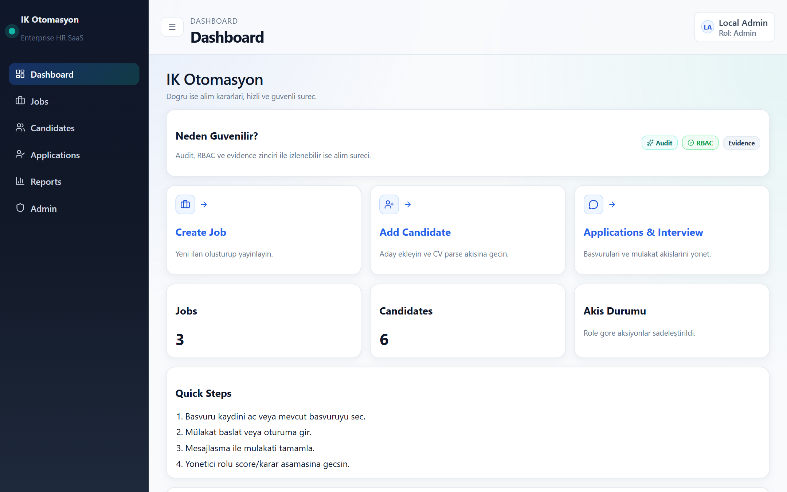
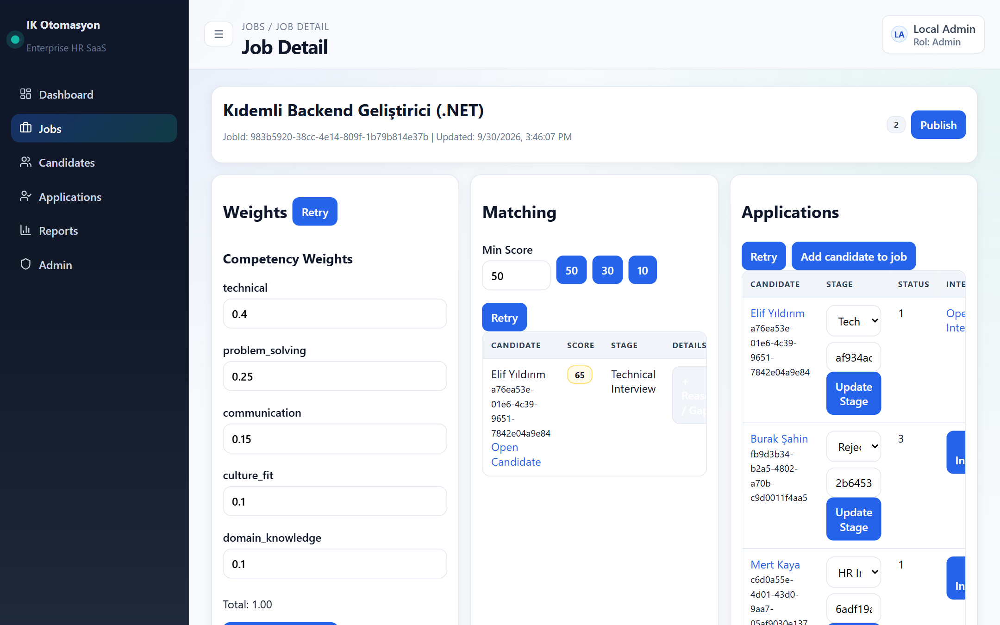
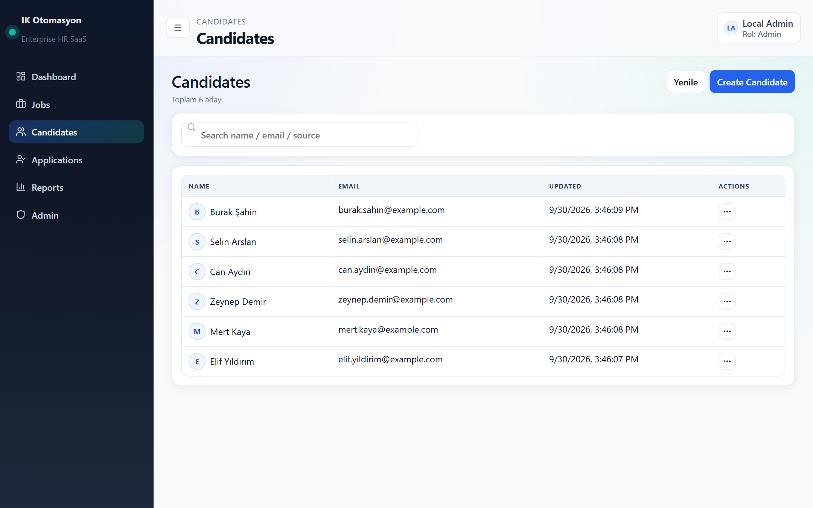
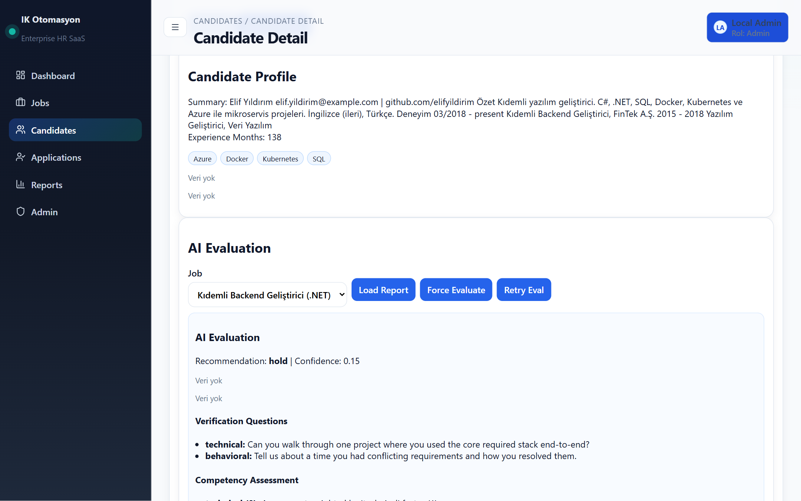
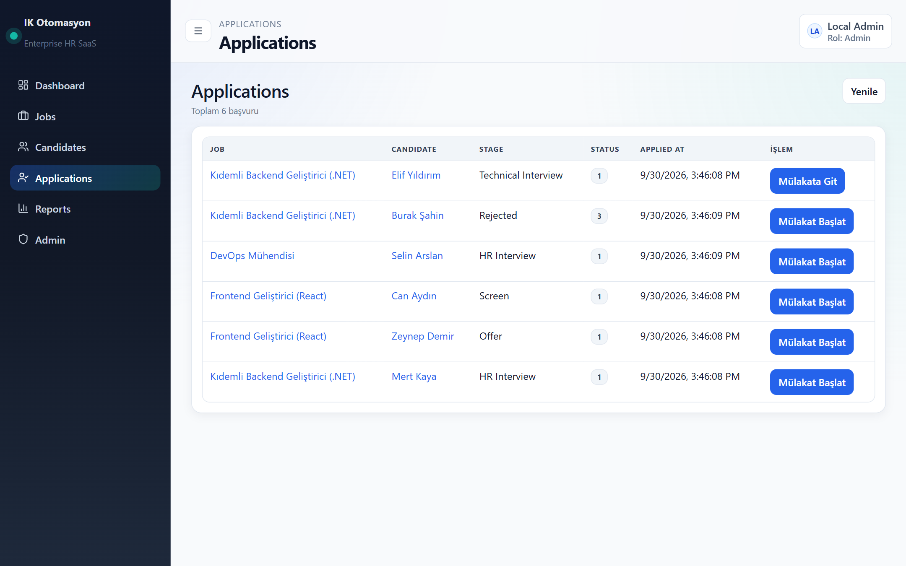
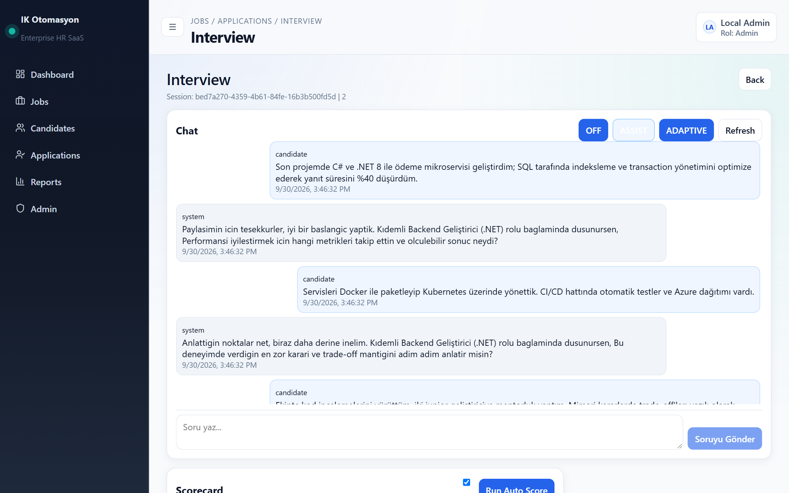
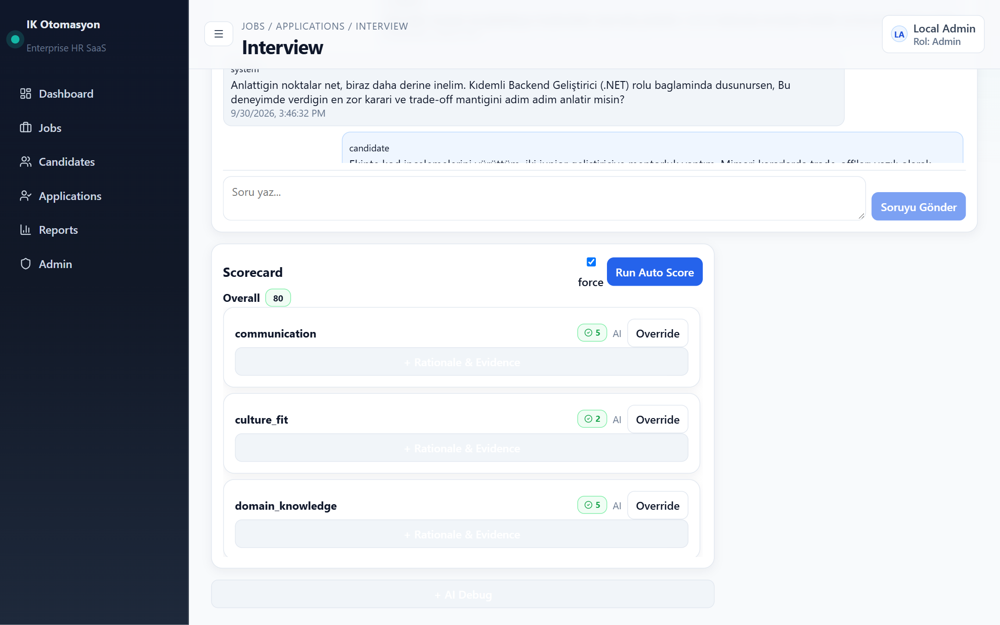
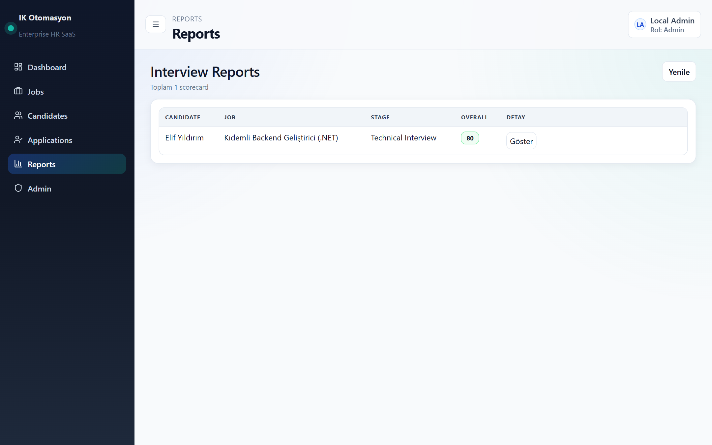
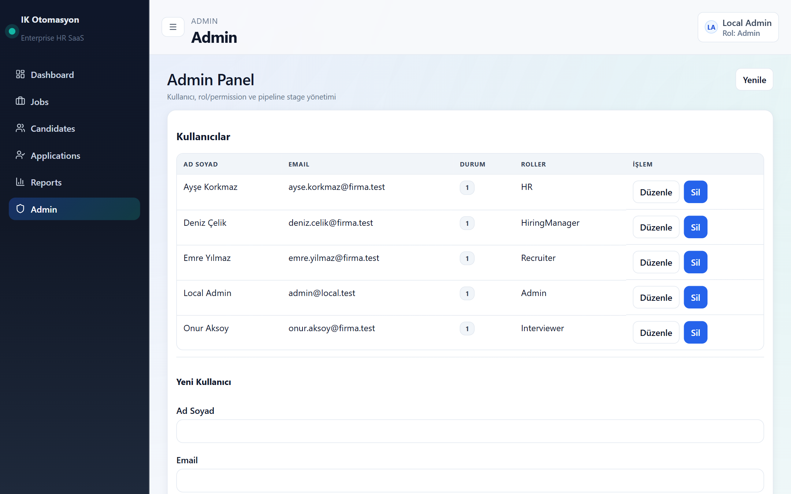

# AI Recruitment Platform — Yapay Zekâ Destekli İşe Alım Sistemi

> İlan açmaktan teklif aşamasına kadar tüm işe alım sürecini tek panelde yöneten; CV'leri otomatik okuyan, adayları ilana göre puanlayan ve mülakatları yapılandırılmış puan kartıyla değerlendiren uçtan uca bir İK platformu.



---

## Hangi sorunu çözüyor?

İşe alım ekipleri zamanlarının büyük kısmını tekrar eden işlere harcar: yüzlerce CV'yi tek tek okumak, adayları Excel'de takip etmek, mülakat notlarını farklı yerlerde tutmak, "bu aday neden elendi?" sorusuna geriye dönük cevap bulmaya çalışmak.

Bu platform bu adımları tek bir akışta birleştirir:

```
İlan oluştur → CV yükle → Otomatik ayrıştır → İlana göre eşleştir → Mülakat yap → Puan kartı → Rapor
```

## Öne çıkan özellikler

| | Özellik | İK için anlamı |
|---|---|---|
| 📄 | **Otomatik CV ayrıştırma** | PDF/DOCX CV'den beceriler, deneyim süresi, diller ve bağlantılar otomatik çıkarılır; elle veri girişi biter. |
| 🎯 | **Aday–ilan eşleştirme skoru** | Her aday, ilanın gerekli becerilerine ve deneyim şartına göre 0–100 arası puanlanır; güçlü yönler ve eksikler gerekçesiyle gösterilir. |
| ⚖️ | **Ayarlanabilir yetkinlik ağırlıkları** | Her pozisyon için teknik, problem çözme, iletişim, kültür uyumu gibi yetkinliklerin ağırlığını İK belirler. |
| 🔄 | **Aşama bazlı süreç takibi (ATS)** | Başvuru → Ön Eleme → İK Mülakatı → Teknik Mülakat → Teklif → İşe Alındı / Red. |
| 💬 | **Yapay zekâ destekli mülakat** | Adayın cevaplarına göre bir sonraki soruyu öneren mülakat asistanı (Kapalı / Asistan / Adaptif modlar). |
| 📊 | **Yapılandırılmış puan kartı** | Mülakat, rubrik kriterlerine göre otomatik puanlanır; **son söz her zaman insanda**: her puan gerekçesiyle birlikte İK tarafından değiştirilebilir. |
| 🔐 | **Rol bazlı yetkilendirme** | Admin, İK, İşe Alım Uzmanı, İşe Alım Yöneticisi, Mülakatçı gibi rollerle herkes yalnızca yetkili olduğu veriyi görür. |
| 🧾 | **KVKK ve denetim izi** | Aday açık rıza kaydı, veri saklama süresi ve kritik işlemlerin denetim kaydı (kim, ne zaman, neyi değiştirdi). |

## Ekran görüntüleri

### İlan detayı: yetkinlik ağırlıkları ve aday eşleştirme
Pozisyona özel yetkinlik ağırlıkları, eşleşme skoruna göre sıralanan adaylar ve başvuruların aşama yönetimi tek ekranda.



### Aday havuzu


### Otomatik CV analizi ve yapay zekâ değerlendirmesi
Yüklenen CV'den çıkarılan beceri ve deneyim bilgileri; adaya özel doğrulama soruları ve yetkinlik değerlendirmesi.



### Başvuru süreci takibi
Tüm başvuruların hangi aşamada olduğu tek bakışta görülür; mülakat doğrudan buradan başlatılır.



### Yapay zekâ destekli mülakat
Sistem, adayın cevabına göre pozisyon bağlamında derinleştirici bir sonraki soruyu önerir.



### Mülakat puan kartı
Rubrik kriterlerine göre otomatik puanlama. Her kriter İK tarafından **"Override"** ile gerekçeli olarak düzeltilebilir.



### Raporlar


### Kullanıcı ve rol yönetimi


---

## Tasarım ilkeleri

- **İnsan karar verir, yapay zekâ destekler.** Otomatik puanlar öneridir; her puanın gerekçesi görünür ve değiştirilebilir. Kanıt yetersizse sistem puan uydurmak yerine *"yetersiz kanıt"* der.
- **Şeffaflık.** Eşleşme skorunun hangi becerilerden geldiği ve hangi şartların eksik kaldığı listelenir.
- **Sağlayıcıdan bağımsız yapay zekâ.** Bir LLM servisi (ör. OpenAI uyumlu API) bağlanabilir; bağlı değilken sistem kural tabanlı modda çalışmaya devam eder.
- **Güvenlik ve izlenebilirlik.** JWT kimlik doğrulama, izin bazlı yetkilendirme, denetim kayıtları ve her isteğin uçtan uca takip edilebilmesi (correlation ID).

## Teknik altyapı

| Katman | Teknoloji |
|---|---|
| Backend | .NET 8 Web API, Entity Framework Core, JWT, RBAC |
| Frontend | React, TypeScript, Vite, Tailwind CSS |
| Veritabanı | PostgreSQL |
| CV ayrıştırma | PdfPig (PDF), NPOI (DOCX) |
| Yapay zekâ | Sağlayıcıdan bağımsız LLM istemcisi + kural tabanlı yedek |
| Dağıtım | Docker Compose, Nginx |

## Çalıştırma

Gereksinim: Docker Desktop

```bash
cp .env.example .env        # JWT_SECRET değerini (en az 32 karakter) doldurun
docker compose up --build -d
```

- Arayüz: http://localhost:3000
- API dokümantasyonu (Swagger): http://localhost:8080/swagger

Geliştirme ortamında demo yönetici hesabı: `admin@local.test` / `Admin123!`

Örnek CV dosyaları: `sample-data/` klasöründe.

Ayrıntılı teknik dokümantasyon için [`docs/`](docs/) klasörüne bakın.

---

*Ekran görüntülerindeki aday ve kullanıcı bilgileri kurgusaldır.*
