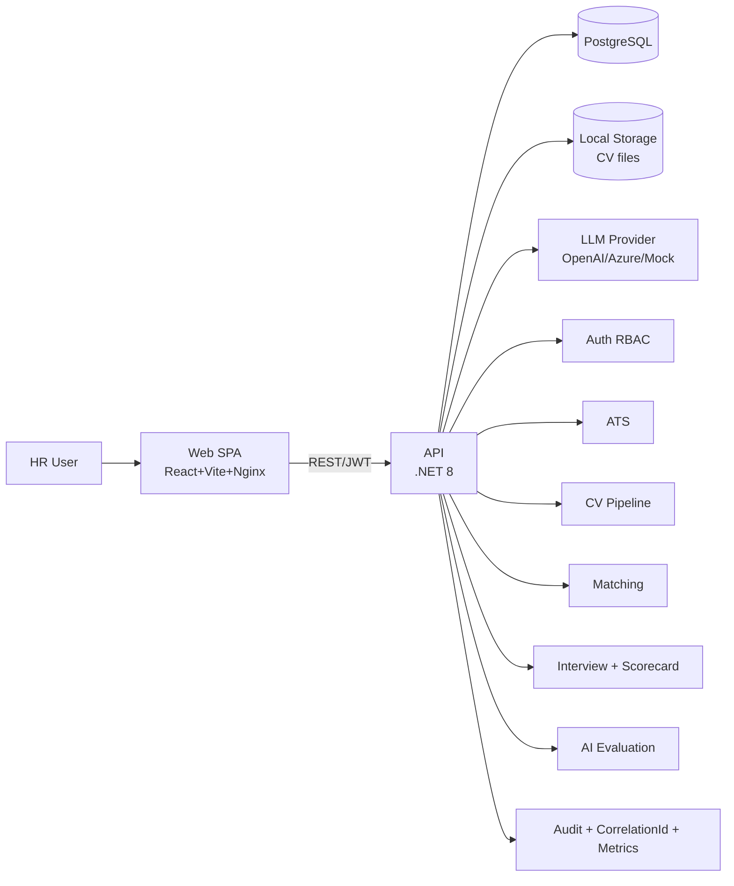

> Canonical copy: `docs/reports/architecture-3min.md`

# Architecture (3 Dakika Konusma Metni)

## 1) Modul Haritasi (yaklasik 60-90 sn)
- Auth/RBAC: JWT login/refresh + permission bazli endpoint korumasi.
- ATS Core: Job, Candidate, Application, Pipeline stage.
- CV Pipeline: upload -> parse -> structured candidate profile.
- Matching: deterministic skor + reasons/gaps.
- Interview + Scoring: chat session, rubric score, evidence, human override.
- AI Evaluation: job + profile bazli uzman raporu, version history.

## 2) Guvenlik ve Dayaniklilik (yaklasik 60 sn)
- Permission bazli 401/403 ayrimi net.
- Audit log kritik aksiyonlari ve mutating denemeleri kaydeder.
- Rate limit, timeout, retry, circuit breaker ile servis korumasi.
- Secret yonetimi env ile; Production'da `JWT_SECRET` yoksa fail-fast.
- Migration job (`migrate`) ile release sirasinda schema kontrolu.

## 3) Operasyon ve Izlenebilirlik (yaklasik 60 sn)
- Correlation id ile UI hatasi <-> backend log eslestirme.
- AI debug endpoint ile insight/plan/fallback gorunurlugu.
- LLM hatasi/guardrail ihlalinde deterministic fallback kesintisiz devam eder.
- CI gate: build/test + migration drift + vulnerability kontrolleri.

## 1 Sayfa Diyagram (Mermaid)

